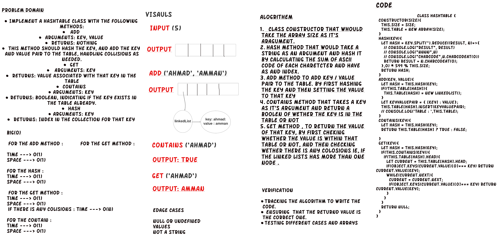

# HashTables Implementation

***Implement a Hashtable Class with the following methods:***

**add**
- Arguments: key, value
- Returns: nothing
- This method should hash the key, and add the key and value pair to the table, handling collisions as needed.

**get**
- Arguments: key
- Returns: Value associated with that key in the table

**contains**
- Arguments: key
- Returns: Boolean, indicating if the key exists in the table already.

**hash**
- Arguments: key
- Returns: Index in the collection for that key

## Language: `JavaScript`

## Approach & Efficiency

**Time Complexity:** O(1)

**Space Complexity:** O(1) 

## Running Tests

If you setup your folders according to the above guidelines, running tests becomes a matter of deciding which tests you want to execute.  Jest does a good job at finding the test files that match what you specify in the test command

From the root of the `data-structures-and-algorithms` folder, execute the following commands:

- **Run every possible test** - `npm test`
- **Run a test for a data structure** - `npm test hashtable.test.js`

#### Live Tests

Note that when you check your code into GitHub, all of your tests will automatically execute. These results should match your own, and will be found on the  **Actions** tab

# Whiteboard:

