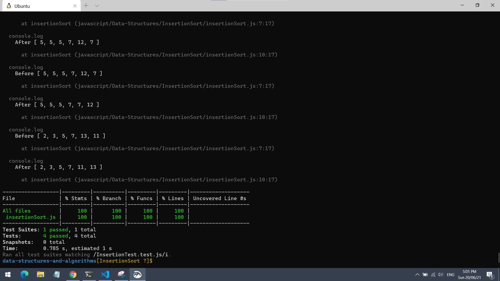
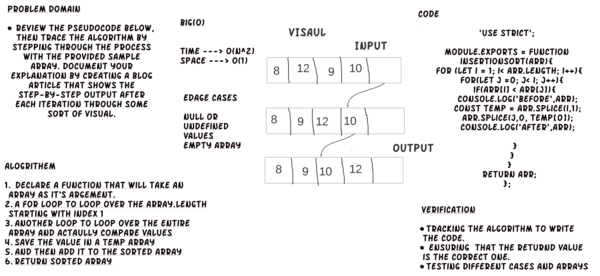

# Insertion Sort

Review the pseudocode below, then trace the algorithm by stepping through the process with the provided sample array. Document your explanation by creating a blog article that shows the step-by-step output after each iteration through some sort of visual.eys appear in the same order in sorted output as they appear in the input array to be sorted.

[Blog.md-Link](https://github.com/yasmeenokh/data-structures-and-algorithms/blob/InsertionSort/javascript/Data-Structures/InsertionSort/BLOG.md)

## Language: `JavaScript`

- **Run every possible test** - `npm test`
- **Run a test for a data structure** - `npm test insertionTest.test.js `

## Test 

## WhiteBoard

