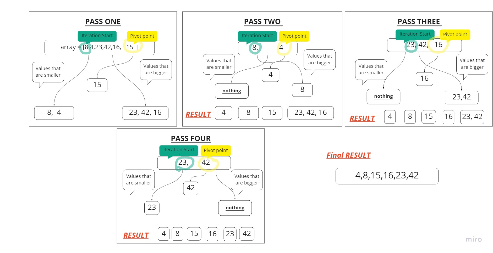

# Quick Sort 

is a divide-and-conquer algorithm. It works by selecting a 'pivot' element from the array and partitioning the other elements into two sub-arrays, according to whether they are less than or greater than the pivot. For this reason, it is sometimes called **partition-exchange sort.**

[README-FILE](https://github.com/yasmeenokh/data-structures-and-algorithms/blob/mergeSort/javascript/Data-Structures/QuickSort/README.md)

## Pseudocode

    ALGORITHM QuickSort(arr, left, right)
        if left < right
            // Partition the array by setting the position of the pivot value 
            DEFINE position <-- Partition(arr, left, right)
            // Sort the left
            QuickSort(arr, left, position - 1)
            // Sort the right
            QuickSort(arr, position + 1, right)

    ALGORITHM Partition(arr, left, right)
        // set a pivot value as a point of reference
        DEFINE pivot <-- arr[right]
        // create a variable to track the largest index of numbers lower than the defined pivot
        DEFINE low <-- left - 1
        for i <- left to right do
            if arr[i] <= pivot
                low++
                Swap(arr, i, low)

        // place the value of the pivot location in the middle.
        // all numbers smaller than the pivot are on the left, larger on the right. 
        Swap(arr, right, low + 1)
        // return the pivot index point
        return low + 1

    ALGORITHM Swap(arr, i, low)
        DEFINE temp;
        temp <-- arr[i]
        arr[i] <-- arr[low]
        arr[low] <-- temp

# Trace

**Sample Arrays:** [8,4,23,42,16,15]

**First pass**

We first will start with choosing a pivot point(normally the most right element) in our case will be **15**, and break our main into smaller sub arrays based on that pivot point, so anything smaller will be placed on the left side so we have [8,4] on the left of 15, and anything bigger than the pivot point will be placed of the right so we have [23,42,16]. So our set of arrays are [8,4] [15] [23,42,16]

**Second pass**
We break our sub arrays as we did with the main, so [8,4] we choose a pivot point in our case here, will be **4**, anything smaller, which in our case here is nothing, and anything bigger placed to the right [8].

**Third pass**
As for the right array, we choose a pivot point in our case here, will be **16**, anything smaller, which in our case here is nothing, and anything bigger placed to the right [23,42]. So our set of arrays are [4] [8] [15] [16] [23,42].

**forth pass**
We take our last sub array choose a pivot point, which will be **42**, anything smaller will be placed to left [23], and anything bigger will be placed to the right which is nothing in our case. Now our set of array are [4] [8] [15] [16] [23] [42].

**Fifth pass**
join our sorted arrays into the main array to get [4,8,15,16,23,42]

## Efficiency

**Time:** O(n(log(n)))

**Space:** O(1)