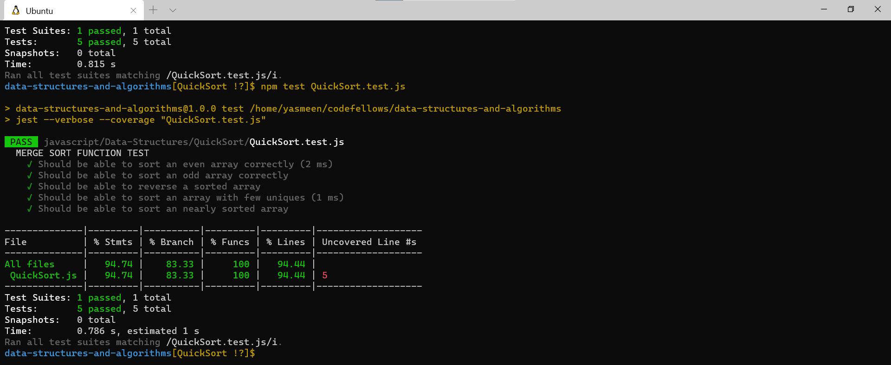
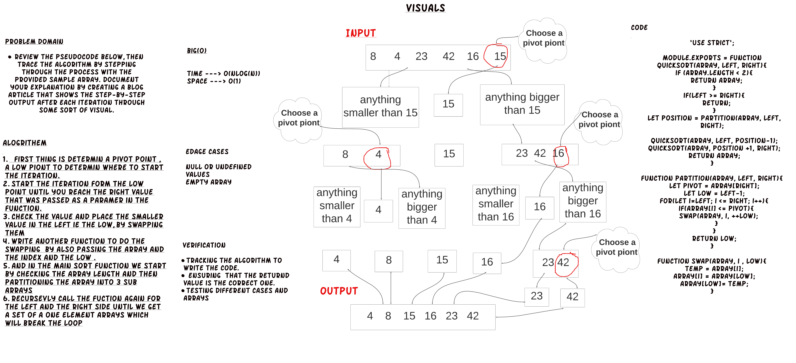

# Quick Sort

Review the pseudocode below, then trace the algorithm by stepping through the process with the provided sample array. Document your explanation by creating a blog article that shows the step-by-step output after each iteration through some sort of visual.

[Blog.md-Link](https://github.com/yasmeenokh/data-structures-and-algorithms/blob/QuickSort/javascript/Data-Structures/QuickSort/BLOG.md)

- **Run every possible test** - `npm test`
- **Run a test for a data structure** - `npm test QuickSort.test.js `

## Language: `JavaScript`

## Test 

## WhiteBoard
