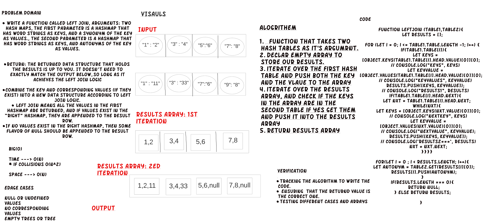
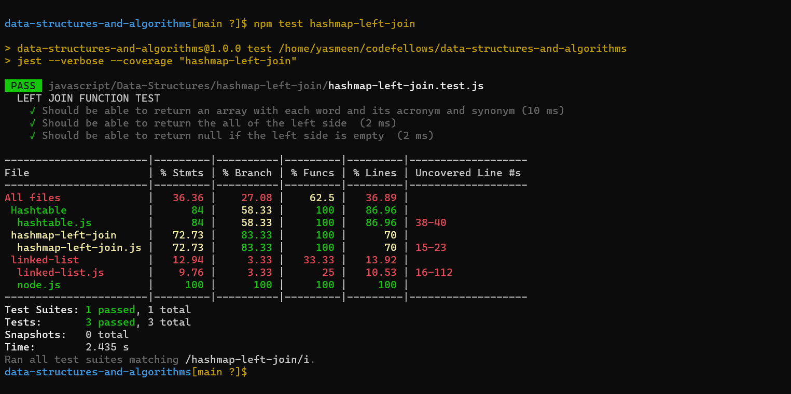

# Hashmap-Left-Join

**Write a function that LEFT JOINs two hashmaps into a single data structure.**

* Write a function called left join
* Arguments: two hash maps
* The first parameter is a hashmap that has word strings as keys, and a synonym of the key as values.
* The second parameter is a hashmap that has word strings as keys, and antonyms of the key as values.
* Return: The returned data structure that holds the results is up to you. It doesn’t need to exactly match the output below, so long as it achieves the LEFT JOIN logic
* Combine the key and corresponding values (if they exist) into a new data structure according to LEFT JOIN logic.
* LEFT JOIN means all the values in the first hashmap are returned, and if values exist in the “right” hashmap, they are appended to the result row.
* If no values exist in the right hashmap, then some flavor of NULL should be appended to the result row.

## Language: `JavaScript`

## Approach & Efficiency

**Time Complexity:** O(n)
* if collisions O(n^2)

**Space Complexity:** O(n) 

## Running Tests

If you setup your folders according to the above guidelines, running tests becomes a matter of deciding which tests you want to execute.  Jest does a good job at finding the test files that match what you specify in the test command

From the root of the `data-structures-and-algorithms` folder, execute the following commands:

- **Run every possible test** - `npm test`
- **Run a test for a data structure** - `npm hashmap-left-join.test.js`

#### Live Tests

Note that when you check your code into GitHub, all of your tests will automatically execute. These results should match your own, and will be found on the  **Actions** tab

# Whiteboard:

