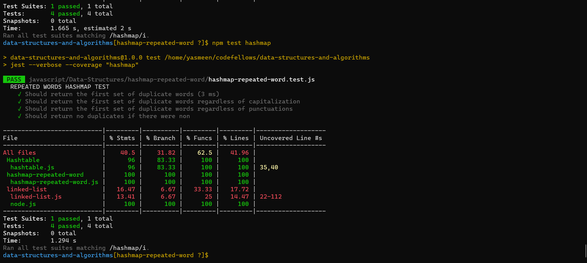
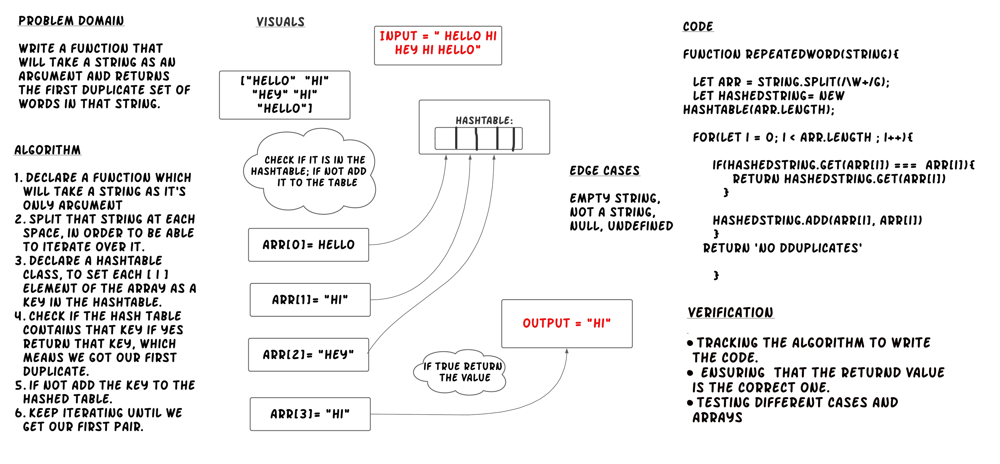

# HashMap Repeated word Function 

**Write a function called repeated word that finds the first word to occur more than once in a string:**

* Arguments: string
* Return: string

## Language: `JavaScript`

## Approach & Efficiency

**Time Complexity:** O(n)

**Space Complexity:** O(n) 

## Running Tests

If you setup your folders according to the above guidelines, running tests becomes a matter of deciding which tests you want to execute.  Jest does a good job at finding the test files that match what you specify in the test command

From the root of the `data-structures-and-algorithms` folder, execute the following commands:

- **Run every possible test** - `npm test`
- **Run a test for a data structure** - `npm test hashmap-repeated-word.test.js`

#### Live Tests

Note that when you check your code into GitHub, all of your tests will automatically execute. These results should match your own, and will be found on the  **Actions** tab

# Whiteboard:

