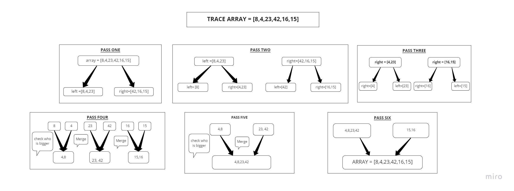

# Merge Sort 

Merge sort is a sorting algorithm that uses the “divide and conquer” concept. Given an array, we first divide it in the middle and we get 2 arrays. We recursively perform this operation, until we get to arrays of 1 element. Then we start building up the sorted array from scratch, by ordering the individual items we got.

[README-FILE](https://github.com/yasmeenokh/data-structures-and-algorithms/blob/mergeSort/javascript/Data-Structures/mergeSort/README.md)

# Pseudocode

    ALGORITHM Mergesort(arr)
    DECLARE n <-- arr.length
           
    if n > 1
      DECLARE mid <-- n/2
      DECLARE left <-- arr[0...mid]
      DECLARE right <-- arr[mid...n]
      // sort the left side
      Mergesort(left)
      // sort the right side
      Mergesort(right)
      // merge the sorted left and right sides together
      Merge(left, right, arr)

    ALGORITHM Merge(left, right, arr)
    DECLARE i <-- 0
    DECLARE j <-- 0
    DECLARE k <-- 0

    while i < left.length && j < right.length
        if left[i] <= right[j]
            arr[k] <-- left[i]
            i <-- i + 1
        else
            arr[k] <-- right[j]
            j <-- j + 1
            
        k <-- k + 1

    if i = left.length
       set remaining entries in arr to remaining values in right
    else
       set remaining entries in arr to remaining values in left

# Trace

**Sample Arrays:** [8,4,23,42,16,15]

**First pass**
We divide the array into 2 arrays so we get [8,4,23] and [42,16,15]

**Second Pass** 
We divide each of our two arrays further more so we get [8] [4,23] and [42] [16,15]

**Third Pass** 
We divide our arrays that contain more then one element once more so we get [4] [23] and [16] [15], so now  we have a list of 1-item arrays

**Forth Pass**
Merge each pair of individual element (which is by default, sorted) into sorted arrays of 2 elements, so Now we order them in sorted pairs: [4,8] [23,42] [15,16], Merge each pair of sorted arrays of 2 elements into sorted arrays of 4 elements, so we order the first two arrays together so we get [4,8,23,42] and [16,15]

**Fifth Pass**
we finally merge the the other array as well so we get a sorted array as [4,8,23,42,16,15]

## Efficiency

**Time:** O(n(log(n)))

**Space:** O(n)