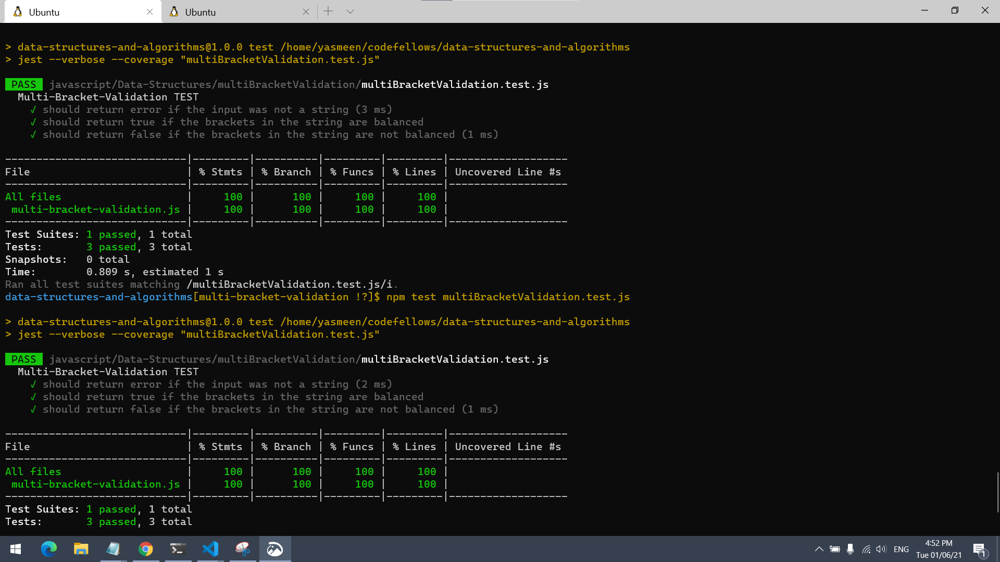
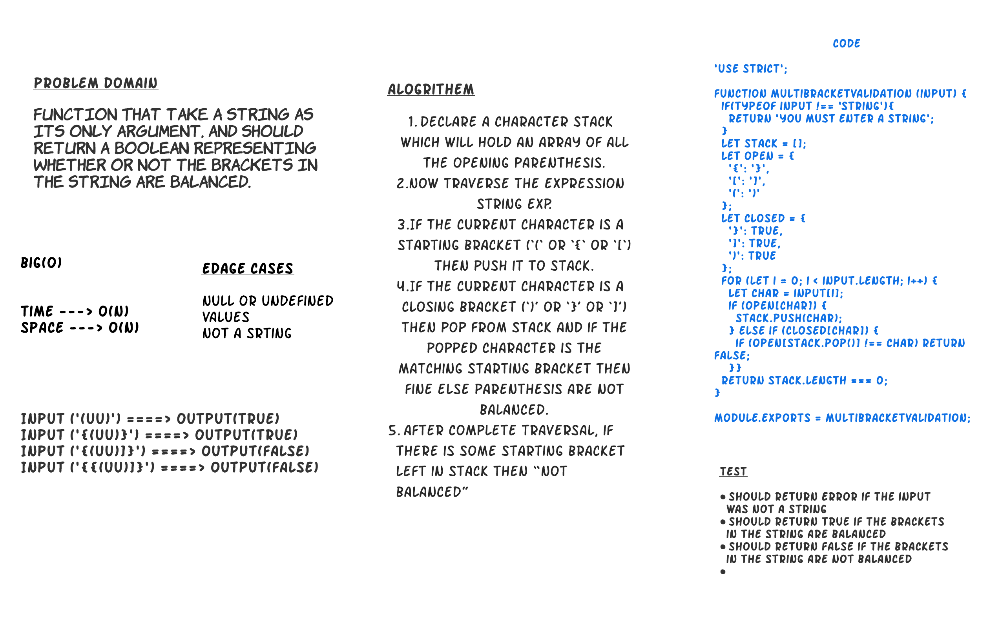

# multiBracketValidation 

Your function should take a string as its only argument, and should return a boolean representing whether or not the brackets in the string are balanced. 

## Language: `JavaScript`

- **Run every possible test** - `npm test`
- **Run a test for a data structure** - `npm test multiBracketValidation.test.js `

