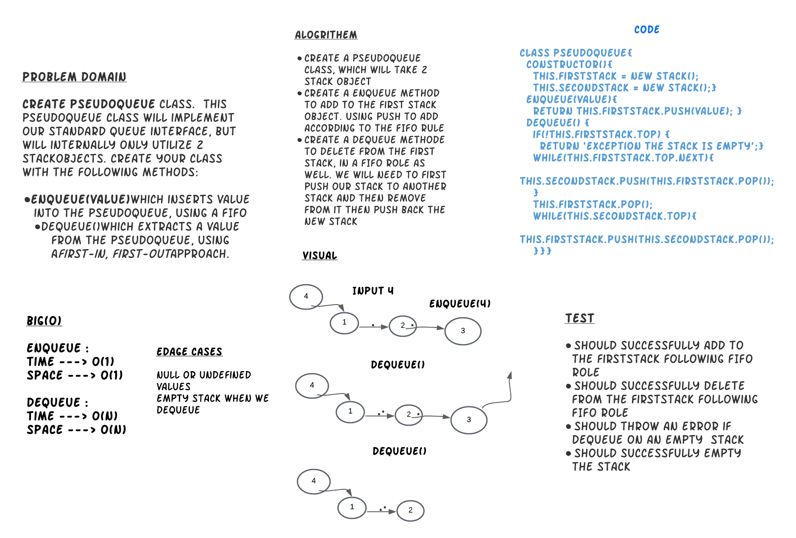
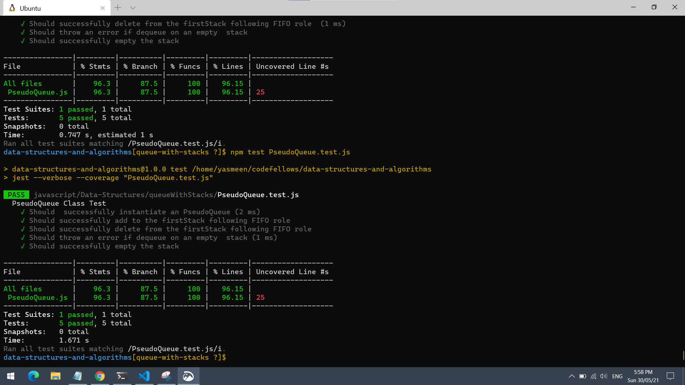

# Queue With Stacks
## Implementation 

Create a brand new PseudoQueue class. , this PseudoQueue class will implement our standard queue interface (the two methods listed below), but will internally only utilize 2 Stack objects. Ensure that you create your class with the following methods:

enqueue(value) which inserts value into the PseudoQueue, using a first-in, first-out approach.
dequeue() which extracts a value from the PseudoQueue, using a first-in, first-out approach.

## Language: `JavaScript`

## Running Tests

If you setup your folders according to the above guidelines, running tests becomes a matter of deciding which tests you want to execute.  Jest does a good job at finding the test files that match what you specify in the test command

From the root of the `data-structures-and-algorithms` folder, execute the following commands:

- **Run every possible test** - `npm test`
- **Run a test for a data structure** - `npm test PseudoQueue.test.js`

