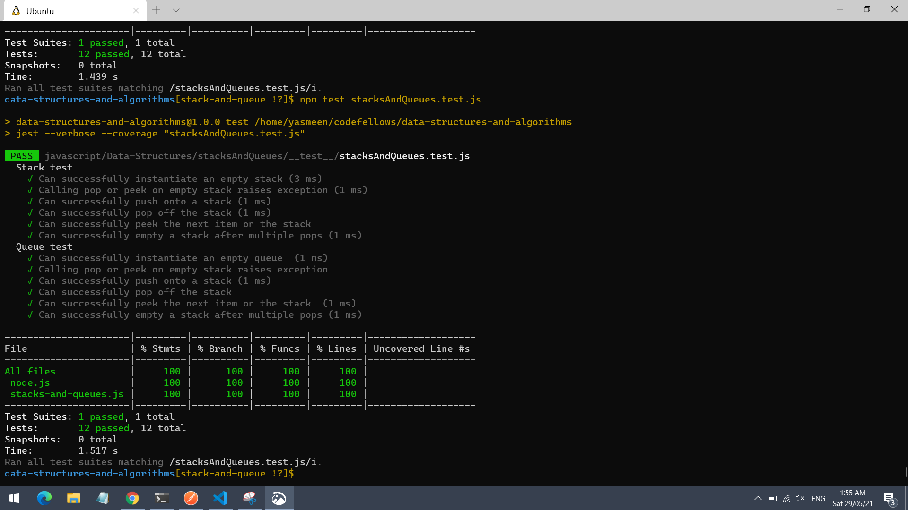
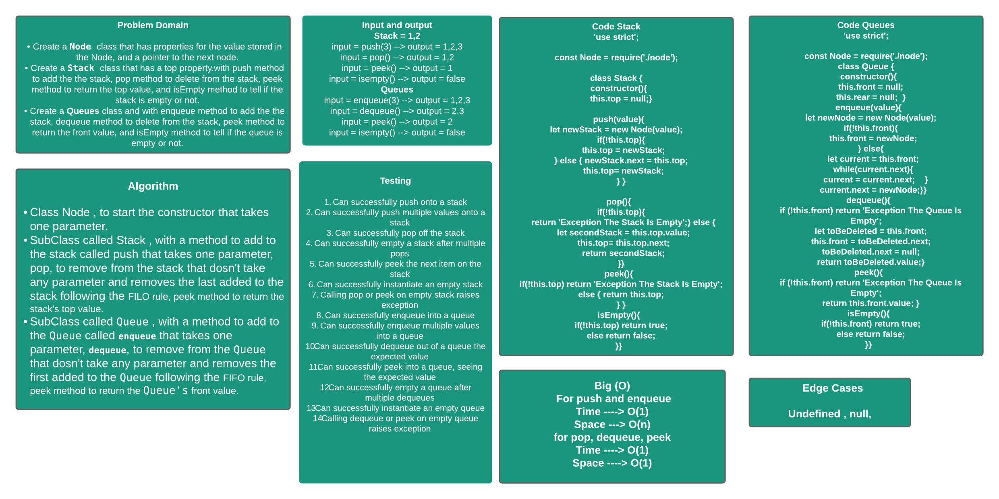

# Stacks and Queues

Create a Stack class and with push method to add the the stack, pop method to delete from the stack, peek method to return the top value, and isEmpty method to tell if the stack is empty or not.

Create a Queues class and with enqueue method to add the the stack, dequeue method to delete from the stack, peek method to return the front value, and isEmpty method to tell if the queue is empty or not.

## Language: `JavaScript`

- **Run every possible test** - `npm test`
- **Run a test for a data structure** - `npm test stacksAndQueues.test.js `

# Whiteboard:

