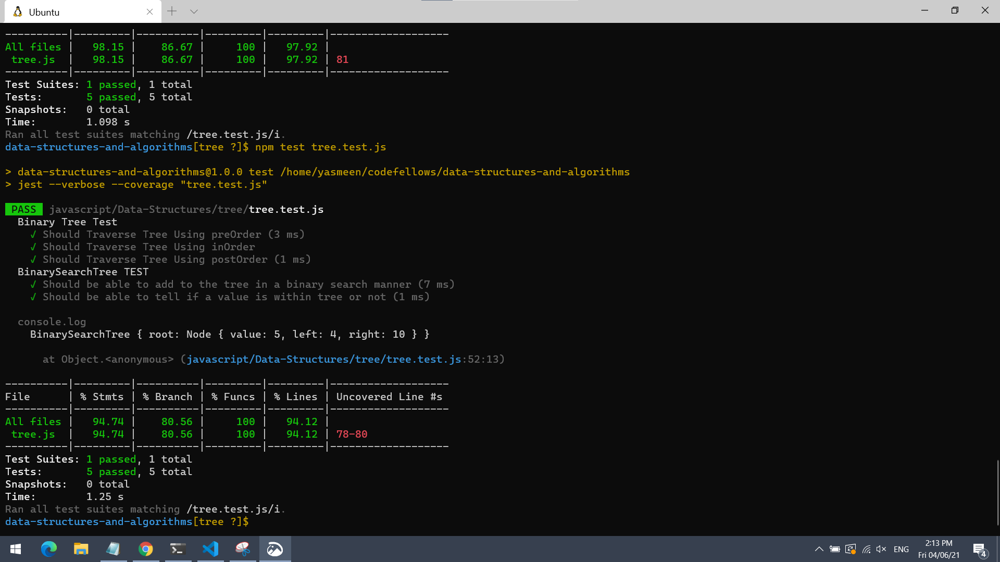
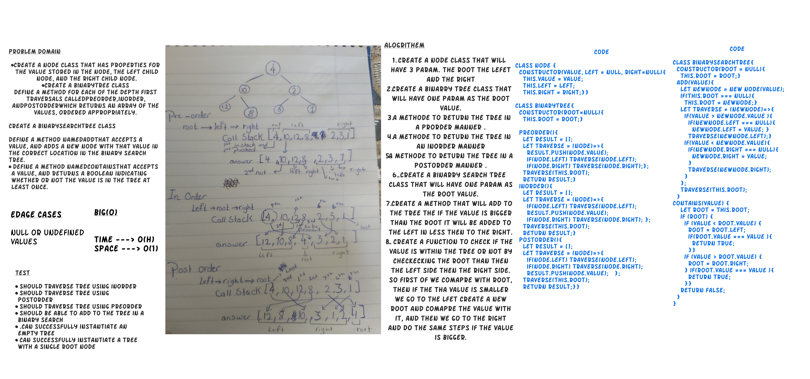

# Trees

- Create a Node class that has properties for the value stored in the node, the left child node, and the right child node.
- Create a BinaryTree class
- Define a method for each of the depth first traversals called preOrder, inOrder, and postOrder which returns an array of the values, ordered appropriately.

## Language: `JavaScript`

- **Run every possible test** - `npm test`
- **Run a test for a data structure** - `npm test tree.test.js `

# Whiteboard:

